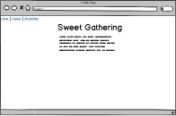
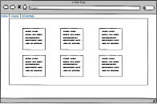
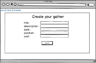
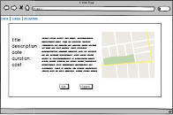

# Sweet Gathering

Link: https://sweet-gathering.herokuapp.com/

## Challenge

To create a CRUD app for users to post and view the information of gatherings. User can also add latitude and longitude to show the exact locations of the gatherings.

## Technologies

* React
* CSS
* JSX
* Express
* PSQL
* Google-Maps-React

## Install & Run

1. Clone the repository
2. `npm install`
3. run `npm start` to play

## Included Features

* User can create posts information including title, description, date, time, latitude and longitude.
* Allowing users to post exact locations on the map and view other users by using the google API.
* User can view all gatherings page, single gathering page, create page and edit page.

## CRUD Algorithm

I made by using React.js for the front-end and Node.js(Express)/PostgreSQL for the back-end. And I used Node.js(Express) for the backend to connect data written in PostgreSQL with front-end written in React.js. Different components written in React.js showing different pages. All gatherings page show all gatherings by in recently added time order. The show/single page can be accessed by clicking the div box with including each event title with brief information in all gatherings page. The show/single page shows more specific information about each different gathering. Users can either delete or edit information of specific gathering by clicking the buttons in show/single page. By using the Google-Maps-React, It makes easier for users to put latitude and longitude for the event information to locate the exact event location with markers on the google map.

## User Stories:

New Gathering Page: As a user I want to be able to create a new gathering with specific information (title, description, date, time, latitude and longitude)

See All Page: As a user I want to be able to see all gatherings I posted

Edit Page: As a user I want to be able to update a information (title, description, date, time, latitude and longitude) to reflect my current needs

Delete Functionality: As a user I want to be able to delete a gathering plan if I no longer need it/if it is no longer available

I feel this project would be especially useful to people who want to save their gatherings/plans with specific location information showing on the google map.

But there are few more features I want to add. I want to add more features such as add an function that leads postings posts into calender component to see better and easy view of when the gatherings are on. For authentication functionality, I was trying to use the auth0 library but still working on it.

## Wireframes:

